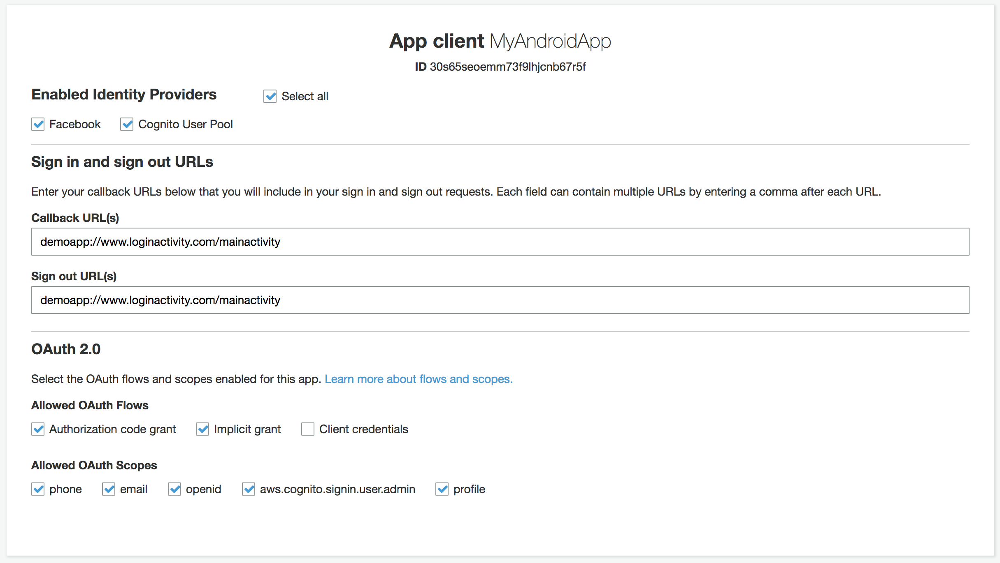

# Running this sample

Make changes to the values found in the [strings.xml file](app/src/main/res/values/strings.xml)
See following sections for explanation on what these fields are.

# Amazon Cognito Auth SDK for Android
You can now use Amazon Cognito Auth to easily add sign-in and sign-out to your mobile apps. Your User Pool in Amazon Cognito is a fully managed user directory that can scale to hundreds of millions of users, so you don't have to worry about building, securing, and scaling a solution to handle user management and authentication.

# Introduction
The Amazon Cognito Auth SDK for Android simplifies adding sign-up, sign-in functionality in your apps.<br/>
With this SDK, you can use Cognito User Pools’ app integration and federation features, with a customizable UI hosted by AWS to sign up and sign in users, and with built-in federation for external identity providers via SAML.<br/>
To learn more see our [Developer Guide](http://docs.aws.amazon.com/cognito/latest/developerguide/what-is-amazon-cognito.html). <br/>

If you are looking for our SDK to access all user APIs for Cognito User Pools, see the [Android Cognito Identity Provider SDK ](https://github.com/aws/aws-sdk-android/tree/master/aws-android-sdk-cognitoidentityprovider).

# Using Amazon Cognito Auth Android SDK
Find the Android sample for this SDK at the [GitHub Repository](https://github.com/awslabs/aws-sdk-android-samples/tree/master/AmazonCognitoAuthDemo).

## Dependencies

Working with `Android Studio 3.1.3`

Add the following dependencies to your `app/build.gradle`.
<br/>

***AWS Android Cognito Auth*** The SDK with sign-in and sign-up functions `aws-android-sdk-cognitoauth`
```
dependency {
  compile 'com.amazonaws:aws-android-sdk-cognitoauth:2.6.+@aar'
}
```
To add other AWS Android SDK's in your app read the [Guide for AWS Android Mobile SDK](http://docs.aws.amazon.com/mobile/sdkforandroid/developerguide/setup.html).
<br/>

***Chrome Custom Tabs*** This SDK opens Cognito's hosted webpage's on Chrome.<br/>
```
dependency {
  compile 'com.android.support:customtabs:25.0.0+'
}
```
**Note** Chrome is required on the Android device to use this SDK.

## Instantiate Cognito Auth
Create a new instance of `Auth` with the following userpool settings.

**cognitoAuthWebDomain** The Cognito's authentication domain. <br/>This domain will point to the hosted UI pages. This domain can be created in userpool settings.<br/>This is just the domain name without the scheme. The SDK will always use *https*. <br/>**e.g.** foo.auth.us-east-1.amazoncognito.com

**cognitoClientId** The app client ID can be found by navigating to the `App client settings` in the Cognito UserPools console.

**signInRedirectUri** The Fully Qualified Domain Name (FQDN) to which Cognito must redirect to after authentication.<br/>
This must include the scheme. **e.g.** myApp://www.myApp.com

**signOutRedirectUri** The Fully Qualified Domain Name (FQDN) to which Cognito must redirect to after logout.<br/>This must also include the scheme.

```java
Auth.Builder builder = new Auth.Builder();
builder.setAppClientId(cognitoClientId)
       .setAppCognitoWedDomain(cognitoAuthWebDomian)
       .setSignInRedirect(signInRedirectUri)
       .setSignOutRedirect(signOutRedirectUri);
```
Set a callback for Cognito Auth that will be invoked after successful authentication or on failure.
```java
class callback implements AuthHandler {
    @Override
    public void onSuccess(AuthUserSession session) {
      // This will invoked to return tokens on successful authentication or when valid tokens are available locally.
      // 'session' will contain valid tokens for the user.
    }

    @Override
    public void onSignout() {
      // This will be invoked on successful sign-out.
    }

    @Override
    public void onFailure(Exception e) {
      // This will be invoked when error conditions. Probe the exception to get the exception details.
    }
}
```
Assign the `callback` to `Auth`.
```java
builder.setAuthHandler(new callback());
```
Create an instance for Cognito Auth.
```java
Auth cognitoAuth = builder.build();
```
## AndroidManifest
### Add intent-filter
Add an `intent-filter` in the app manifest to allow Android to invoke your app `Activity` after successful authentication and signout.<br/>
```xml
<intent-filter>
      <action android:name="android.intent.action.VIEW" />
      <category android:name="android.intent.category.DEFAULT" />
      <category android:name="android.intent.category.BROWSABLE" />
      <data android:host="YOUR_REDIRECT_URI_AUTHORITY"android:scheme="YOUR_REDIRECT_SCHEME"/>
</intent-filter>
```
### Add permissions
```xml
<uses-permission android:name="android.permission.INTERNET" />
<uses-permission android:name="android.permission.ACCESS_NETWORK_STATE" />
```
## Get Session
Use the `getSession` API to authenticate a user and get tokens for the user.<br/>
```java
cognitoAuth.getSession();
```
This will open the Cognito login webpage and prompt the user to authenticate.
If valid tokens are already available for the last authenticated user, the tokens are returned from the `callback`.

The Cognito login webpage is launched on ***Chrome Custom Tabs***. After the user successfully authenticates and on redirect to the set `signInRedirectUri`, the Android will invoke the app `Activity` which has registered an `intent-filter` for `signInRedirectUri`.

Pass this redirect URI to the SDK to get the tokens for the user.<br/>
```java
cognitoAuth.getTokens(getIntent().getData());
```
## Sign out
This will sign out the current user by clearing cached tokens.<br/>
```java
cognitoAuth.signOut();
```

# Developer Feedback
We welcome developer feedback on this project. You can reach us by creating an issue on the GitHub repository or posting to the Amazon Cognito Identity forums and the below blog post:<br/>
* [GitHub Repository](https://github.com/aws/aws-sdk-android/tree/master/aws-android-sdk-cognitoauth)
* [AWS Forums](https://forums.aws.amazon.com/index.jspa)


## Screenshots


----



